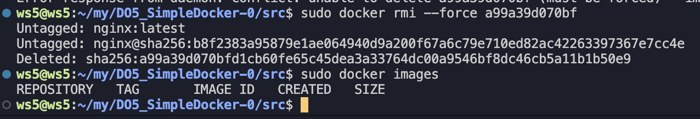

# Simple Docker
## Part 1. Готовый докер

* выкачиваем образ через
```bash
sudo docker pull nginx
```

* Проверяем что образ установился через
```bash
sudo docker images
```

*  Запустить докер образ через
```bash
sudo docker run -d nginx
```
* Проверяем что образ запустился через
```bash
sudo docker ps
```

* Посмотреть информацию о контейнере через
```bash
sudo docker inspect [container_id]
```


* Определить и поместить в отчёт размер контейнера, список замапленных портов и ip контейнера
* По строке "ShmSize": 67108864, понимаем что размер контейнера 67108864
* По строке "Ports": {"80/tcp": null }, понимаем что контейнер использует 80 порт
* По строке "IPAddress": "172.17.0.2", понимаем что контейнер использует 172.17.0.2 ip
* Остановить докер образ через
```bash
sudo docker stop [container_id]
```
* Проверить, что образ остановился через
```bash
sudo docker ps
```

* Запустить докер с замапленными портами 80 и 443 на локальную машину через команду
```bash
sudo docker run -p 80:80 -p 443:433 -d nginx
```

* Проверить, что в браузере по адресу *localhost:80* доступна стартовая страница **nginx**

* Перезапустить докер контейнер через
```bash
sudo docker restart [container_id]
```
* Проверить любым способом, что контейнер запустился

* Проверяем доступ к странице


## Part 2. Операции с контейнером
* Прочитать конфигурационный файл *nginx.conf* внутри докер контейнера через команду *exec*
```bash
sudo docker exec [container_id] cat ./etc/nginx/nginx.conf
```

* Создать на локальной машине файл *nginx.conf*
* Настроить в нем по пути */status* отдачу страницы статуса сервера **nginx**

* Скопировать созданный файл *nginx.conf* внутрь докер образа через команду `docker cp`
```bash
sudo docker cp nginx.conf [container_id]:/etc/nginx
```

* Перезапустить **nginx** внутри докер образа через команду *exec*
```bash
sudo docker exec [container_id] nginx -s reload
```
* Проверить, что по адресу *localhost:80/status* отдается страничка со статусом сервера **nginx**

* Экспортировать контейнер в файл *container.tar* через команду *export*
```bash
sudo docker export [container_id] > container.tar
```
* Остановить контейнер
```bash
sudo docker stop [container_id]
```

* Удалить образ через `docker rmi [image_id|repository]`, не удаляя перед этим контейнеры
```bash
sudo docker rmi --force [image_id] 
```

* Удалить остановленный контейнер
```bash
sudo docker rm [container_id]
```

* Импортировать контейнер обратно через команду *import*
```bash
sudo docker import container.tar nginx
```

* Запустить импортированный контейнер
```bash
sudo docker run -it -d -p 80:80 -p 443:433 nginx bash
sudo docker exec [container_id] service nginx start
```

* Проверить, что по адресу *localhost:80/status* отдается страничка со статусом сервера **nginx**


## Part 3. Мини веб-сервер
* Написать мини сервер на **C** и **FastCgi**, который будет возвращать простейшую страничку с надписью `Hello World!`
* Скачиваем библиотеки
```bash
sudo apt-get install libfcgi-dev spawn-fcgi nginx
```
* Компилируем и запускаем сервер на порту 8080
```bash
gcc server.c -lfcgi -o server
spawn-fcgi -p 8080 ./server
```
* Копируем конфиг nginx и запускаем его
```bash
sudo cp nginx.conf /etc/nginx/nginx.conf
sudo service nginx restart
```
* Проверяем страницу


* Положить файл *nginx.conf* по пути *./nginx/nginx.conf* (это понадобится позже)
```bash
mkdir nginx
cp nginx.conf nginx/nginx.conf
```

## Part 4. Свой докер
* Сбилдим докер файл
```bash
sudo docker build -t server:v1 -f Dockerfile4 .
```
* Проверим образ
```bash
sudo docker images
```
* Запустим контейнер
```bash
sudo docker run -d -p 80:81 -v nginx:/etc/nginx/ server:v1
```
* Чекаем сайт


## Part 5. **Dockle**

* Скачиваем dockle
```bash
VERSION=$(curl --silent "https://api.github.com/repos/goodwithtech/dockle/releases/latest" | grep '"tag_name":' | sed -E 's/.*"v([^"]+)".*/\1/') && curl -L -o dockle.deb https://github.com/goodwithtech/dockle/releases/download/v${VERSION}/dockle_${VERSION}_Linux-64bit.deb
```
```bash
sudo dpkg -i dockle.deb && rm dockle.deb
```
* Удаляем старый образ
* Скачиваем новый
```bash
sudo docker build -t server:v1 -f Dockerfile5 .
sudo docker run -d -p 80:81 -v nginx:/etc/nginx/ server:v1
```
* Запускаем dockle
```bash
sudo dockle server:v1
```

## Part 6. Базовый **Docker Compose**
* Установим
```bash
sudo apt-get install docker-compose
```
* Билдим
```bash
sudo docker-compose build
```
* Поднимаем
```bash
sudo docker-compose up
```
* Проверить, что в браузере по *localhost:80* отдается написанная вами страничка, как и ранее
